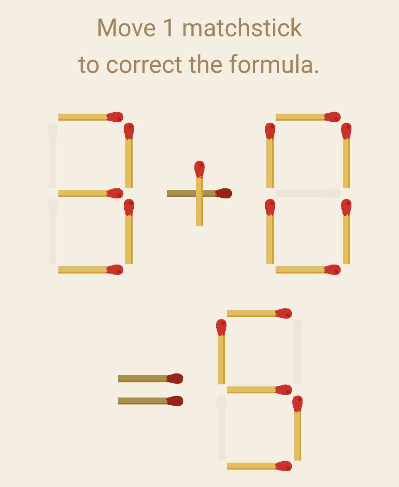
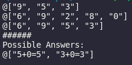

# Motivation 

The idea of this project was to try [nim-lang](https://nim-lang.org/) a promissing programming lang with python-like syntax
The idea came to me when I was playing [this game](https://play.google.com/store/apps/details?id=com.deappsign.math) on my phone so I decided to make a solver for the matchstick problem

The project is written twice once in python and in nim-lang

> one thing to note is that nim is a compiled language not interpreted as python, so no runtime `eval` function and I had to implement it myslef

# Installation

1. clone the repo: `git clone https://github.com/tw0-face/matches.git`
2. `cd matches`
3. compile the nim code `nim c --debugger:native matches.nim`
4. run nim compiled binary `./matches`
5. run python `python matches.py`

# Benchmark

I used [hyperfine](https://github.com/sharkdp/hyperfine) to do bench mark testing on both codes and the results are below

| Command | Mean [ms] | Min [ms] | Max [ms] | Relative |
|:---|---:|---:|---:|---:|
| `python matches.py` | 25.4 ± 1.1 | 23.9 | 29.5 | 14.69 ± 9.06 |
| `./matches` | 1.7 ± 1.1 | 0.8 | 5.6 | 1.00 |

# Demo

## Problem

## nim-lang matches output

## Answer 🥳

